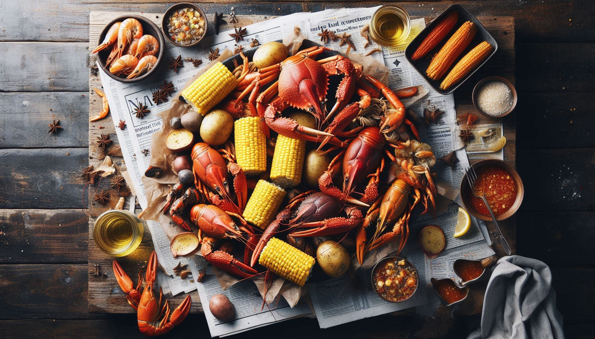

# The King Crab Hack 
## An Analytical Guide to Seafood-boil Orders Using Mixed Integer Optimization and CVXPY



## Story
As a foodie, I have a soft spot for seafood and Vietnamese food. My favorite restuarnt to get both in Milwaukee is this place called King Crab Shack. They serve not only authentic Vietnamese dishes, but also cajun style seafood boil with a twist of Vietnamese. 

Their menu can be found [here](https://thekingcrabshack27th.com/menu).  

## The Menu


| Build your own bag  | Price $/lb | 
| :------  | ---: | 
| crawfish	     |12.99 |
| mussels	     |12.99 |
| clams	     |12.99 |
| king crab    |	54.99|
| lobster tail (x1)	  |	26.99|
| lobster tail (x2)	  |	49.99|
| live lobster (x1)|	49.99|
| scallops	|	32.99|
| shrimp (whole)|16.99|
| shrimp (cleaned) |18.99|
| snow crab     |	35.99|
| dungeness crab|35.99|
| corn (x1)    |	0.75|
| potato (x1)	  |0.55|
| sausage (x1)	 |1.99|

|Combos	|	Included*	|	Price $/each	|
| :------  | ---: | ---: | 
|combo 1	|shrimp, mussels, crawfish/clams	|	41.99 |
|combo 2	|snow crab, mussels/crawfish	|	45.99 |
|combo 3	|snow crab, 2x lobster tails	|	82.99 |
|combo 4	|snow crab, shrimp, mussels	|	59.99 |
|combo 5	|snow crab, crawfish, clams	|	58.99 |
|combo 6	|2x lobster tails, shrimp, mussels	|	73.99 |
|Dungenese combo 	|Dungenese crab, shrimp	|	54.99 |
|King crab combo	|King crab, shrimp	|	72.99 |
|Live lobster combo	|1 x live lobster, mussels	|	62.99 |
|combo special 1	|snow crab (1/2), 1x lobster tail, shrimp (1/2) 	|	49.99 |
|combo special 2	|King crab (1/2), shrimp (1/2), crawfish/mussels (1/2)	|	39.99 |

*Each Combo also includes 1 corn, 1 potato, and 1 sausage.

*The crawfish, mussels, and clams are interchangable 

## "Build Your Own Bag" or Combos? 

The resturant offers two ways of ordering your preferred seafood: you can either go by "Build Your Own Bag" style, with which you simply select whatever you like, or go by their "combos", which come with 2 to 3 types of seafood with some sides. Naturally, with each combo, the price comes with a certain amount of quantity discount. 
 
For instance, let us look at Combo 2. Based on "Build Your Own Bag" price, the total order of "1 lb of snow crab + 1 lb of crawfish + 1 corn + 1 potato + 1 sausage" would have cost $52.27. But Combo 2 is offered as a package at $45.99. 

## Mission

I need to place a large order for a big party I'm hosting. To feed enough people, I plan to order the following: 

crawfish:	3 lbs
mussels:	1 lbs
clams:	1 lbs
king crab:	3 lbs
headless shrimp:	3 lbs
snow	crab: 3 lbs
corn:	5 ea.
potato:	5 ea.
sausage:	5 ea.

With this big order in mind, I certainly can forego "Build Your Own Bag" option. But I was also hoping to save a few bucks without changing my order - if I can combine their existing combos and individual seafood by the pound, I believe this goal is achievable. 

So let us do some math to plan my order, so that I can make the most out of the money I'm about to spend. 

## The Math
I implement a [Mix Integer Program (MIP)](https://en.wikipedia.org/wiki/Integer_programming). Below is the mathematical model. 

Indices

$i \in \{'crawfish', 'mussels', 'shrimp', 'snow crab', ..., 'sausage' \}$: seafood by the pound 

$j \in \{'combo 1', 'combo 2', ... , 'combo special 2'\}$: combo

Decision Variables

$X_i \in \{0,1\} $


## The Code

The above mathematical model is encoded in Python Jupyter notebook with [CVXPY](https://www.cvxpy.org/) as the solver. Adding the following routine is necessary. 

```javascript
import numpy as np
import pandas as pd
```
Import CVXPY library, assuming CVXPY has been installed properly.

```javascript
import cvxpy as cp
```
 
First, I preprocess the data, i.e., the KCS's menu pricing information and my required order that are contained in a few csv files. 

```javascript
A = pd.read_csv('input/combos.csv')
C = pd.read_csv('input/menu_byob.csv')
P = pd.read_csv('input/menu_combo.csv')
order = pd.read_csv('input/cust_order.csv')
D = order

A = A.fillna(0)
A = A.set_index('combo')
A.sort_index(inplace=True)
A = A.reindex(sorted(A.columns), axis=1)

C = C.set_index('seafood')
C.sort_index(inplace=True)

P = P.set_index('combo')
P.sort_index(inplace=True)

# Total numbers of seafood types and combos

num_seafood = len(C)
num_combo = len(P)

seafoods = C['price'].keys().tolist()
seafoods[seafoods.index('ccm')] = 'crawfish-clams-mussels'
combos = P['price'].keys().tolist()
```

"Customer order" info needs modifying on two places (1)(2)

```javascript
# (1) Split number of "tails" into numbers of "tail_1" and "tail_2"

num_tails = D[D['seafood'] == 'tail']['pound'].values[0]
num_1_tail = num_tails % 2
num_2_tail = int(num_tails/2)

# (2) Crawfish, clams, and mussels have the same price and are interchangable
# Combine these items to form a new item, "ccm"

ccm_lbs = D[D['seafood'] == 'crawfish']['pound'].values[0] \
        + D[D['seafood'] == 'clams']['pound'].values[0] \
        + D[D['seafood'] == 'mussels']['pound'].values[0]

```

```javascript
# Add "df_add" to the D dataframe and delete "crawfish", "clams", "mussels", and "tail" from it.

dict_add = {'seafood':['ccm','tail_1','tail_2'], 
            'pound': [ccm_lbs, num_1_tail, num_2_tail]
           }

df_add = pd.DataFrame(dict_add)

D = pd.concat( [D, df_add], axis=0, ignore_index=True )

D.drop(D[D['seafood'] == 'crawfish'].index, inplace=True)
D.drop(D[D['seafood'] == 'clams'].index, inplace=True)
D.drop(D[D['seafood'] == 'mussels'].index, inplace=True)
D.drop(D[D['seafood'] == 'tail'].index, inplace=True)

# Cast all numeric info into numpy arrays for modeling (CVX requirement)

comboMakeUp = A.values
priceByob = C['price'].to_numpy()
priceCombo = P['price'].to_numpy()

D = D.set_index('seafood')
D.sort_index(inplace=True)
demandLBS = D['pound'].to_numpy()

# BYOB Price of the order can be computed immediately

totalByob = np.inner(priceByob, demandLBS)

```

Finally, we are able to construct a problem in CVXPY

```javascript
# Construct a CVXPY problem with the SCIP backend to solve the MIP

# Define decision variables, x[i]: build your own bag seafood, y[j]: numbers of combos

x = cp.Variable(num_seafood, integer=True)
y = cp.Variable(num_combo, integer=True)

# Define objective function

obj_expr = cp.sum(priceCombo @ y) + cp.sum(priceByob @ x)
objective = cp.Minimize(obj_expr)

# Define constraints

constraints = [ comboMakeUp @ y + x >= demandLBS,
              x >=0,
              y>= 0
              ]

# Call the solver

prob = cp.Problem(objective, constraints)
prob.solve()

# Display the solution

print("Status: ", prob.status)
print("The optimal value is:", prob.value)
print("A solution x is")
print(x.value)
print("A solution y is")
print(y.value)

print( )
print("=============== THE KING CRAB HACK ===============")
print( )
print("Here's everything you ordered: ")
print( )
print(order)
print( )
print("'Build Your Own Bag' would have cost: $", round(totalByob,2))
print("\n" "Here's what you should order to get a bang for the buck:" "\n")
for j in range(num_combo):
    if y.value[j] != 0: 
        print(combos[j], " = ", int(y.value[j]))
for i in range(num_seafood):
    if x.value[i] != 0: 
        print(seafoods[i], " = ", int(x.value[i]))  
print( )
print("!! Now, your total (objective value) is: $", round(prob.value,2))
print("!! YOU SAVED: $", round(totalByob - prob.value, 2), "(%s)" % format((totalByob - prob.value) / totalByob, ".0%") )
```


## Result

After running the script, we are able to find at least one optimal solution, as follows. 

```javascript
Status:  optimal
The optimal value is: 372.92
A solution x is
[ 0.  0. -0.  1. -0.  0.  0. -0.  0. -0.  0. -0. -0.]
A solution y is
[ 0.  0.  2. -0. -0.  1.  0. -0. -0.  0. -0.  0.  0. -0. -0.  0.  0.  4.]

=============== THE KING CRAB HACK ===============

Here's everything you ordered: 

      seafood  pound
0    crawfish      3
1     mussels      1
2       clams      1
3        king      3
4        tail      0
5    lob_live      0
6    scallops      0
7   shrimp_wh      0
8   shrimp_hs      3
9        snow      3
10  dungeness      0
11       corn      5
12     potato      5
13    sausage      5

'Build Your Own Bag' would have cost: $ 411.31

Here's what you should order to get a bang for the buck:

combo_2  =  2
combo_4_hs  =  1
combo_sp2_hs  =  4
king  =  1

!! Now, your total (objective value) is: $ 372.92
!! YOU SAVED: $ 38.39 (9%)
```
## Discussion


## Reference

[The King Crab Shack](https://thekingcrabshack27th.com/menu)


